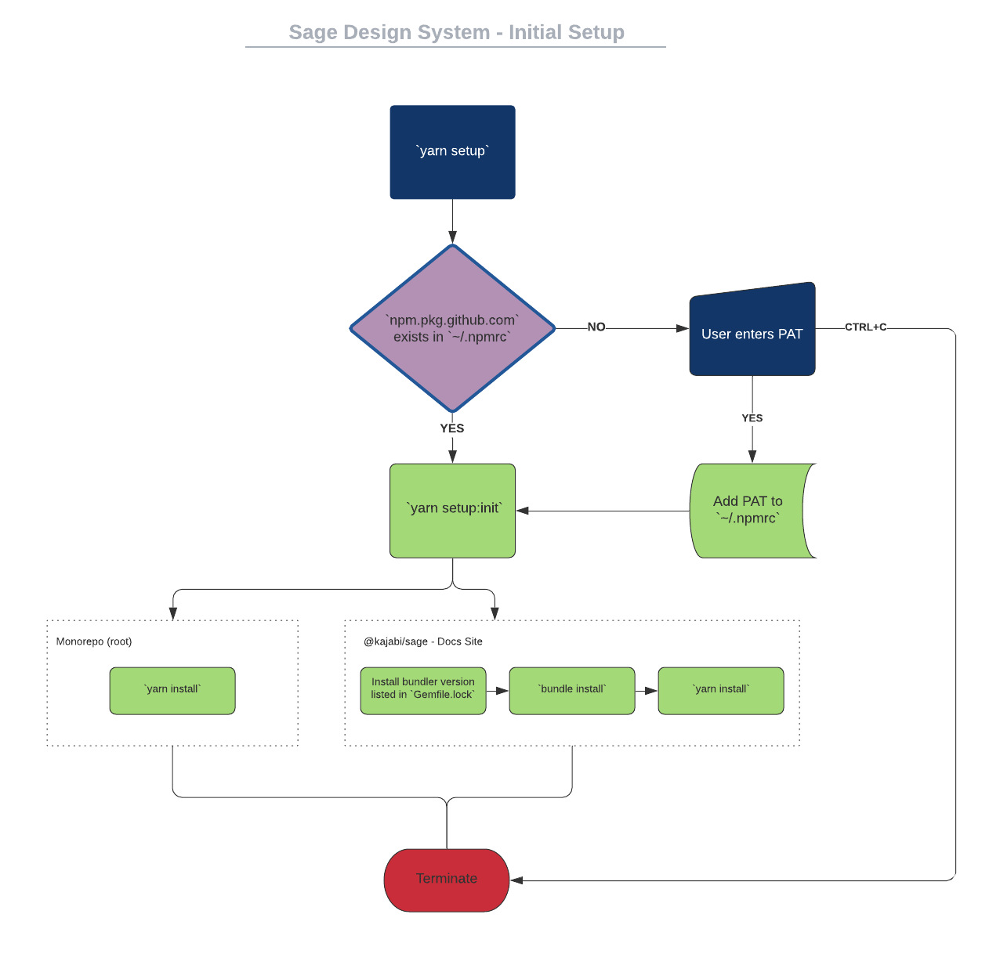
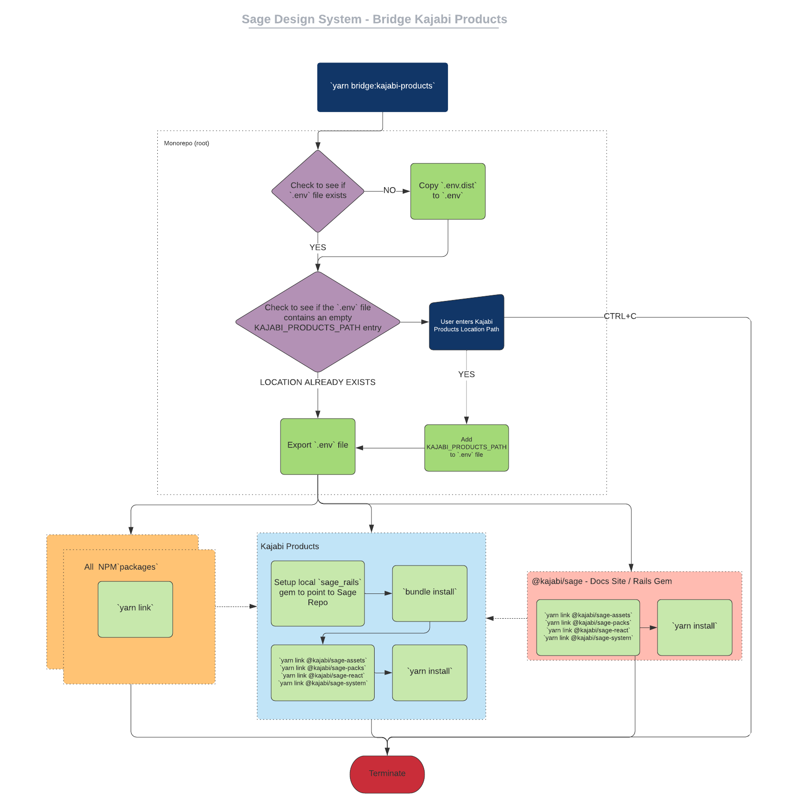

# Sage Design System Automations

The following document describes the internal automations of the Sage Design System.

## Lefthook

[Official Documentation](https://github.com/Arkweid/lefthook)

Lefthook is being utilized to automate behaviors during git based interactions. Configuration for Lefthook can be found in the `lefthook.yml` document at the root of this repository. The following checks are in places:

### `commit-msg`

This repo utilizes the [Conventional Commits Standard](https://www.conventionalcommits.org/en/v1.0.0/) to determine version changes as well as auto-document Changelogs for releases. In order to ensure this behavior a hook is integrated with `commit-msg` and parses it via [commitlint](https://github.com/conventional-changelog/commitlint).

Configuration for [commitlint](https://github.com/conventional-changelog/commitlint) can be found in the `commitlint.config.js` file at the root of this repository.

### `pre-commit`

A hook prior to commit is in place to ensure the integrity of the `yarn.lock` file. If the `yarn.lock` file is not in-sync during release then the CI job will throw an error indicating that the `yarn.lock` is out of date. A script located at `bin/yarn-check.sh` in the root of this repository is designed to verify if yarn is out of sync, and if it is we will [bootstrap](https://github.com/lerna/lerna/tree/main/commands/bootstrap#readme) the Lerna monorepository, add the updated `yarn.lock` and create a separate `chore` commit for the new lock file.

## Initial Setup

A series of automations have been created for initial repository setup. The `yarn setup` script in the root of this repository follows this flow:

Scripts as part of this automation:

- bin/bundle.sh
- bin/setup.sh

## Bridge - Kajabi Products

The Kajabi Products repository needs to be locally linked to your Sage repository in order to have live reloading of your changes during your development cycle. This is administered via a series of automations that follow this flow:

Scripts as part of this automation:

- bin/bundle.sh
- bin/env.sh
- bin/local-link-frontend.sh
- bin/local-link-gem.sh
- bin/local-link.sh

## Bridge - Kajabi Products (DESTROY)

From time to time you will have to destroy your local bridge to test production level code. This is administered via a series of automations that follow this flow:

Scripts as part of this automation:

- bin/bundle.sh
- bin/env.sh
- bin/local-link-frontend.sh
- bin/local-link-gem.sh
- bin/local-link.sh
